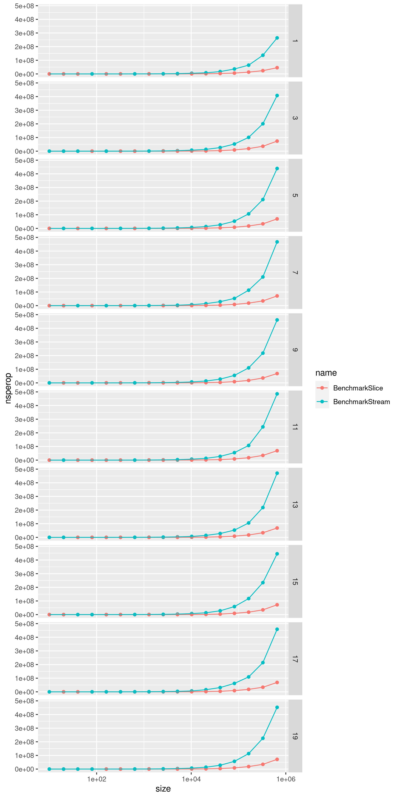
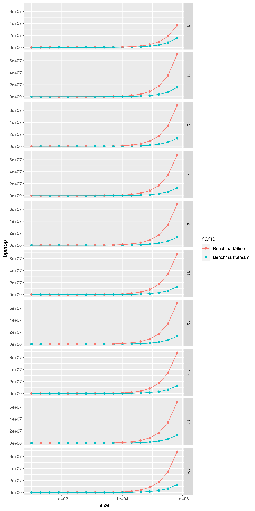

# Higher order functions over collections
## Comparison between slice and channel based approaches

This repo contains the code to perform benchmarks over two simple implementations
of higher order functions.

### Prerequisites

* Go
* R with [`ggplot2`](https://ggplot2.tidyverse.org/) and [`readr`](https://readr.tidyverse.org/) packages installed (for plotting)

### Run benchmarks

The `run_all.sh` script will run the benchmarks and plot the results:

```sh
./run_all.sh
```

#### Other alternatives

To simply run the benchmarks, run:

```sh
go test -benchmem=true -bench=. pkg/enumerable/.
```

To run the benchmarks and save the results as csv, run:

```sh
go run main.go > result.csv
```

To plot the results from the generated csv:

```sh
Rscript plot_results.R
```

### Examples

Included in this repo are examples of the benchmarks run on my machine, as well
as the generated plots:

#### CSV

[result.csv](example/result.csv)

#### Plot of ns/op



#### Plot of B/op

